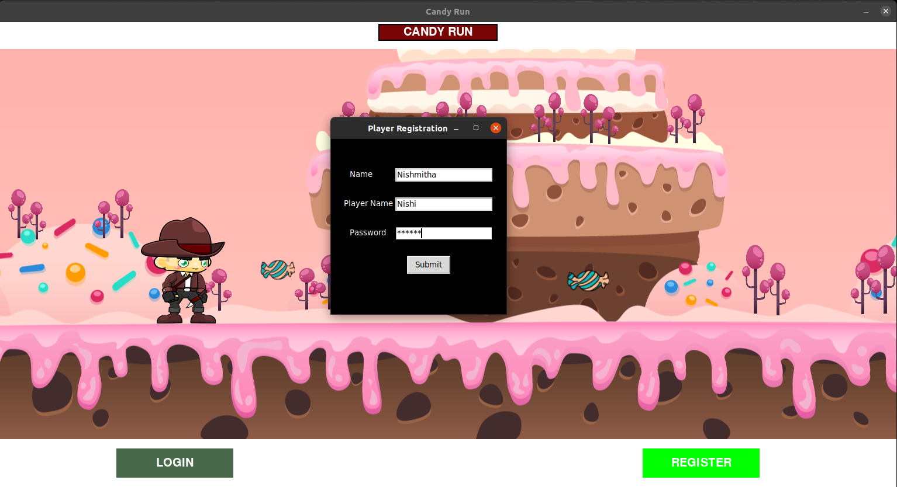
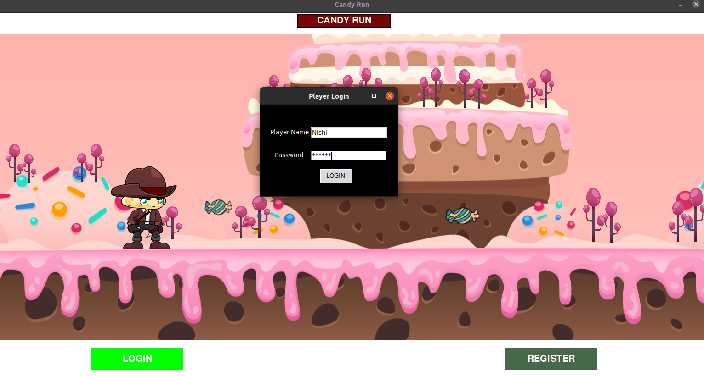
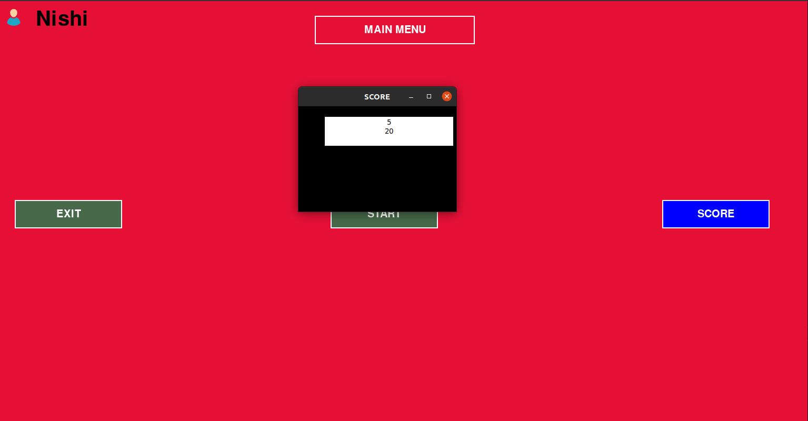

# :runner: :doughnut: Choco-Run-2D :doughnut: :runner:
### :runner: :chocolate_bar: Choco Run 2D is a 2D game made using Python, Pygame, PyMysql and tkinter.
+ **In this game we are maintaing a database to keep track of the players and their score.**
  + ### Registration Module: 
    + Players can register with their name, Players name and a login password.
    + If Users are already registered it will block from registration.
    
        
  + ### Login Module: 
    + Players can login with their Players name and a login password.
    + If login credentials are invalid then user will not be allowed to proceed with the appropriate message.
    
        
  + ### Score Board: 
    + Players Score will be displayed in the main menu score board.
    
         
--- 

### [Pygame](https://www.pygame.org/docs/)
  + Pygame is a cross-platform set of Python modules designed for writing video games. It includes computer graphics and sound libraries designed to be used with the Python programming language.

### [Tkinter](https://anzeljg.github.io/rin2/book2/2405/docs/tkinter/index.html)
  + Tkinter is a Python binding to the Tk GUI toolkit. It is the standard Python interface to the Tk GUI toolkit, and is Python's de facto standard GUI. Tkinter is included with standard Linux, Microsoft Windows and macOS installs of Python
  
### [PyMysql](https://pypi.org/project/PyMySQL/)
  + PyMySQL is an interface for connecting to a MySQL database server from Python. It implements the Python Database API v2. 0 and contains a pure-Python MySQL client library. The goal of PyMySQL is to be a drop-in replacement for MySQLdb.
  
  
---

### Local Setup :wrench:
  1. `Fork and clone the project`
  2. `Install Pygame`

         pip install pygame
  3. `Install Tkinter`

         sudo apt install python3-tk
  4. `Install PyMysql`

         sudo apt install python3-pymysql
  5. `Compose up the Docker-compose.yam file to start mysql service`

         docker-compose up
  6. `Dump the schema file to choco_run Database`

         mysql -uuser -ppassword10 choco_run < /home/schema.sql
  7. `Run the Choco Run 2D Game` :video_game:

         python3 game_module/main_game.py
         
 ---
